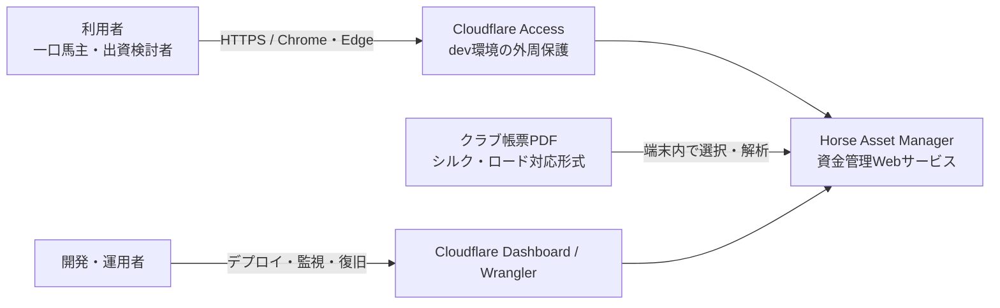
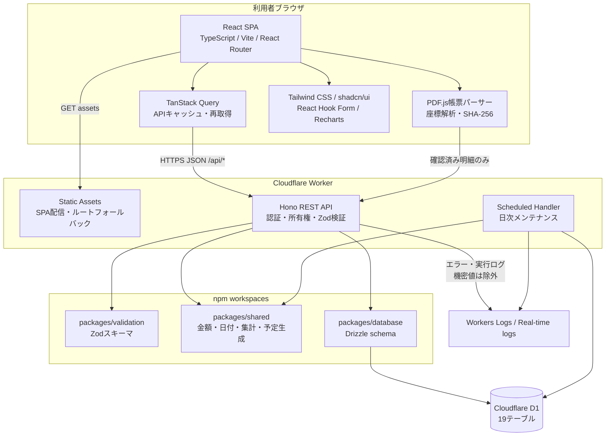
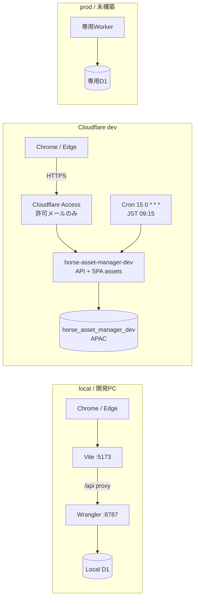
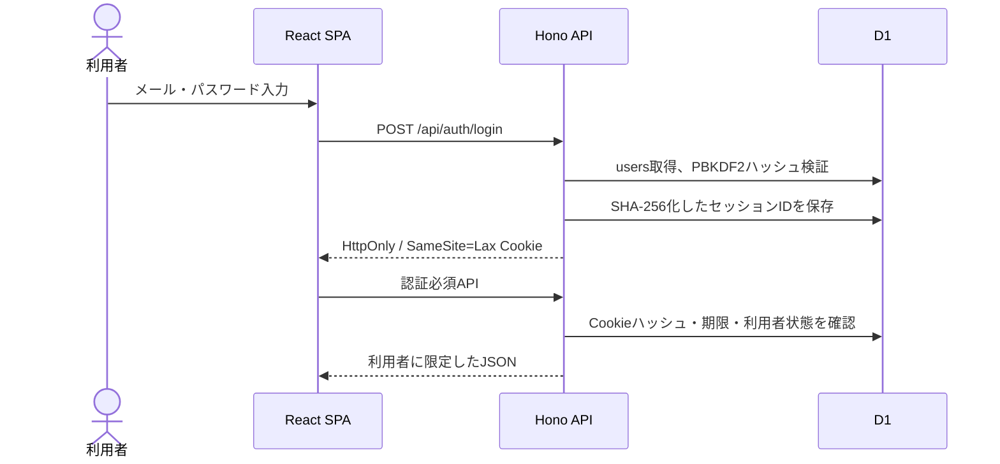
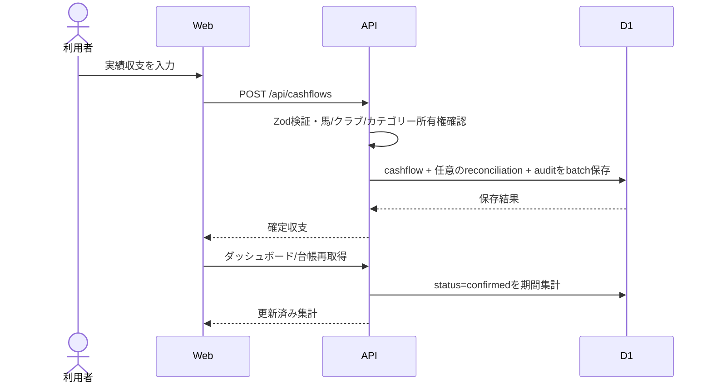
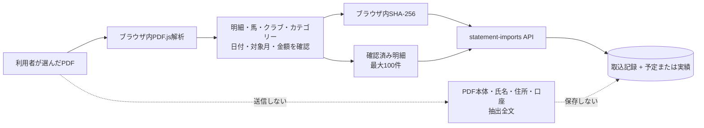
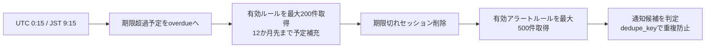

# 02. システム構成・基本設計

## 1. 設計方針

- Windows Web版MVPを、React SPAとCloudflare Workerの単一配信単位で提供する。
- `/api/*` はWorkerのHono APIを先に実行し、それ以外は静的SPAへフォールバックする。
- DBは環境ごとに分離したCloudflare D1を使う。
- WebとAPIで型、金額計算、日付処理、Zodスキーマを共有する。
- PDF帳票の生データは端末内でのみ解析し、確認済みの明細だけをAPIへ送る。
- 予定・実績・出資契約・精算予定を分け、同じ金額を二重集計しない。

## 2. システムコンテキスト図



本システムは外部の競馬情報、レース結果、決済、メール配信サービスへ接続しません。

## 3. コンテナ構成図



## 4. 実行時の責務

| レイヤー | 主な責務 | 主な実装 |
|---|---|---|
| Web UI | 表示、入力、ルーティング、空・エラー状態、レスポンシブ対応 | `apps/web` |
| ブラウザ帳票解析 | PDFテキスト座標解析、帳票判定、明細抽出、SHA-256、利用者確認 | `apps/web/src/features/statement-import` |
| REST API | 認証、同一オリジン検証、所有権確認、Zod検証、業務更新、集計、CSV | `apps/api` |
| 共通ロジック | 円表示、回収率、予算、シミュレーション、日付、予定日生成 | `packages/shared` |
| 入力契約 | Web/API共通の入力・クエリスキーマ | `packages/validation` |
| 永続化 | Drizzleテーブル定義、D1クライアント、制約・インデックス | `packages/database`, `migrations` |
| 定期処理 | 期限超過更新、12か月先予定補充、通知生成、期限切れセッション削除 | Worker Cron |

## 5. リポジトリ構成

```text
horse-asset-manager/
├─ apps/
│  ├─ web/                 React SPA
│  └─ api/                 Hono / Cloudflare Worker
├─ packages/
│  ├─ database/            Drizzle schema・D1接続
│  ├─ shared/              集計・日付・予定生成
│  └─ validation/          共通Zodスキーマ
├─ migrations/             D1マイグレーション
├─ scripts/                ローカル専用seed
├─ tests/e2e/              Playwright E2E
└─ docs/                   要件・設計・テスト・運用資料
```

## 6. 配置構成図



`local`、`dev`、将来の`prod`は、Worker名、環境変数、D1を共有しません。devへサンプルseedは投入しません。

## 7. 主要データフロー

### 7.1 認証



セッション有効期間は14日です。非local環境ではSecure Cookieを使用します。

### 7.2 収支登録と照合



### 7.3 PDF取込のプライバシー境界



### 7.4 日次メンテナンス



## 8. 認証・認可境界

1. `/api/health`、`/api/auth/config`、登録、ログインを除くAPIは認証ミドルウェアを通す。
2. CookieトークンをSHA-256化し、D1のセッションIDと比較する。
3. `users.status=active` かつ期限内のセッションだけを許可する。
4. 参照IDは `assertHorse`、`assertClub`、`assertCategory` または同等の `user_id` 条件で所有権を検証する。
5. 存在する他利用者データも404として扱い、存在を推測させない。
6. GET/HEAD/OPTIONS以外はOriginを検証し、localのlocalhost間だけ例外を許可する。

## 9. データ整合性設計

- Webからの入力は共通Zodスキーマ、APIで再検証する。
- D1に非負、正数、範囲、一意性の制約を持たせる。
- 複数更新は可能な限りD1 `batch()` を使う。
- 定期予定は `user_id + recurring_rule_id + due_on` で一意にする。
- PDF明細は `user_id + statement_import_id + source_line_key` で一意にする。
- 通知は `user_id + dedupe_key` で一意にする。
- 実績集計では `cashflows.status=confirmed` を明示する。

## 10. 技術スタック

| 領域 | 技術 |
|---|---|
| Web | React、TypeScript、Vite、React Router |
| 状態・フォーム | TanStack Query、React Hook Form |
| UI | Tailwind CSS、shadcn/ui、Lucide、Recharts |
| PDF | PDF.js、Web Crypto SHA-256 |
| API | Cloudflare Workers、Hono、TypeScript |
| DB | Cloudflare D1、Drizzle ORM |
| 検証 | Zod |
| テスト | Vitest、Playwright |
| 配布 | 単一WorkerのStatic Assets + API |

## 11. 将来拡張の境界

- 外部認証へ交換する場合も、APIの `AuthUser` と `requireAuth` 境界より内側の所有権設計を維持する。
- 添付ファイルを追加する場合はR2を使い、PDF取込の「本体を保存しない」方針とは別機能として同意と保持期間を定義する。
- 本番環境はdevからD1を共有せず、メール確認、パスワード再設定、レート制限、CSP、運用SLAを追加してから構築する。
- 競馬情報・予想機能は将来拡張にも含めない。
