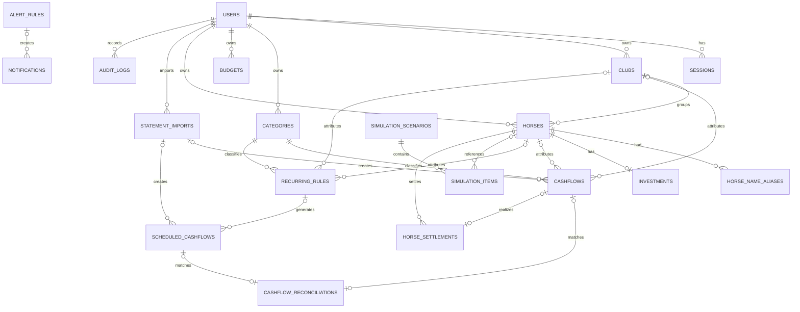
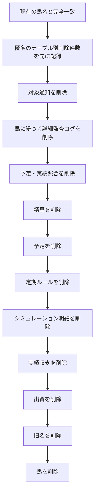

# 03. データベース設計

## 1. 概要

Cloudflare D1（SQLite互換）を使用します。現行スキーマは19テーブルで、Drizzle定義 `packages/database/src/schema.ts` と `migrations/` を正本とします。

## 2. 設計原則

- 金額は円単位の `integer` とし、小数を保存しない。
- 日付は `YYYY-MM-DD`、対象年月は `YYYY-MM`、日時はISO 8601文字列で保存する。
- `sessions` を除く主要業務テーブルは `user_id` を持つ。
- 参照・更新時は主キーだけでなく `user_id` も条件に含める。
- 予定と実績を別テーブルにし、実績集計は `cashflows.status='confirmed'` だけを使う。
- 業務データは原則アーカイブし、馬の明示的な完全削除だけを例外とする。
- 一意制約とDBチェック制約を、ZodによるAPI検証の後段防御として使う。
- 複数テーブル更新はD1 `batch()` を用いて一つの業務操作として扱う。

## 3. テーブル一覧

| # | テーブル | 役割 | 主な保持方針 |
|---:|---|---|---|
| 1 | `users` | 利用者・初期設定状態 | アカウント正本 |
| 2 | `sessions` | ログインセッション | 期限切れを日次削除 |
| 3 | `clubs` | 利用者固有のクラブ | statusでアーカイブ |
| 4 | `categories` | 支出・入金カテゴリー | statusでアーカイブ |
| 5 | `budgets` | 年間・月間予算 | 期間単位で上書き更新 |
| 6 | `horses` | 候補馬・出資馬 | 明示確認時のみ完全削除 |
| 7 | `horse_name_aliases` | 募集名・旧名 | 馬と共に完全削除 |
| 8 | `investments` | 出資契約 | 原則保持、馬削除時は削除 |
| 9 | `statement_imports` | PDF取込の重複防止記録 | PDF本体・全文は保持しない |
| 10 | `cashflows` | 確定した実績支出・入金 | statusで取消・アーカイブ |
| 11 | `recurring_rules` | 定期予定の生成ルール | statusで無効・終了 |
| 12 | `scheduled_cashflows` | 支出・入金予定 | statusで支払・取消・期限超過 |
| 13 | `cashflow_reconciliations` | 予定と実績の1対1照合 | open/resolved |
| 14 | `simulation_scenarios` | シミュレーション見出し | statusでアーカイブ |
| 15 | `simulation_items` | シミュレーション明細 | シナリオ削除でcascade |
| 16 | `horse_settlements` | 引退後の精算予定・完了 | 完了時にcashflowへ関連付け |
| 17 | `alert_rules` | アラート条件 | 利用者・種別で1件 |
| 18 | `notifications` | アプリ内通知 | dedupe_keyで重複防止 |
| 19 | `audit_logs` | 変更・認証・削除監査 | 馬削除時は匿名監査へ置換 |

## 4. ER概要図

図では可読性のため各テーブルの `user_id` 関係を一部省略しています。

## 5. データ辞書

共通的に使う `created_at`、`updated_at` はISO 8601文字列です。nullableの記載がない項目は必須です。

### 5.1 `users`

| カラム | 型 | 説明 |
|---|---|---|
| `id` | integer PK | 利用者ID |
| `email` | text unique | ログインメール |
| `name` | text | 表示名 |
| `password_hash` | text | PBKDF2-SHA256ハッシュ |
| `role` | text | `user` / `admin` |
| `status` | text | `active` / `disabled` |
| `setup_completed` | integer boolean | 初期設定完了 |

### 5.2 `sessions`

| カラム | 型 | 説明 |
|---|---|---|
| `id` | text PK | CookieトークンのSHA-256ハッシュ |
| `user_id` | integer FK | 利用者。利用者削除時cascade |
| `expires_at` | text | 期限。現在は発行から14日 |
| `last_used_at` | text | 最終使用日時。現行MVPでは更新しない |
| `created_at` | text | 作成日時 |

インデックス: `user_id`、`expires_at`。

### 5.3 `clubs`

`id`, `user_id`, `name`, `short_name?`, `description?`, `status(active/archived)`, timestamps。

制約: `unique(user_id, name)`。インデックス: `(user_id, status)`。

### 5.4 `categories`

`id`, `user_id`, `name`, `category_type(expense/income)`, `system_code?`, `parent_id?`, `sort_order`, `status(active/archived)`, timestamps。

制約:

- `unique(user_id, category_type, name)`
- `unique(user_id, system_code)`。SQLiteではNULLを複数許容する
- 親削除はrestrict

### 5.5 `budgets`

| カラム | 型 | 説明 |
|---|---|---|
| `budget_type` | text | `monthly` / `yearly` |
| `period_key` | text | 年間は`YYYY`、月間は`YYYY-MM` |
| `amount_yen` | integer | 非負の予算額 |
| `note` | text nullable | メモ |

制約: `unique(user_id, budget_type, period_key)`、`amount_yen >= 0`。

### 5.6 `horses`

| 項目群 | カラム |
|---|---|
| 識別・所属 | `id`, `user_id`, `club_id?`, `name`, `name_kana?` |
| 基本情報 | `gender?`, `birth_date?`, `sire?`, `dam?`, `damsire?`, `trainer?` |
| 募集情報 | `recruitment_year?`, `total_price_yen?`, `total_shares?`, `unit_price_yen?` |
| 検討条件 | `planned_shares?`, `initial_payment_yen?`, `expected_monthly_cost_yen?`, `expected_insurance_yen?`, `application_deadline?` |
| 状態 | `status`, `retired_on?`, `settled_on?`, `note?` |

`status` は `considering`, `applied`, `invested`, `active`, `retired`, `settling`, `settled`, `rejected`, `skipped`。金額はNULLまたは非負です。

インデックス: `(user_id,status)`, `(user_id,club_id)`, `(user_id,application_deadline)`。

### 5.7 `horse_name_aliases`

`id`, `user_id`, `horse_id`, `name`, `created_at`。

制約: `unique(user_id, horse_id, name)`。現在名は保存せず、`horses.name` を正本とします。

### 5.8 `investments`

`id`, `user_id`, `horse_id`, `shares`, `unit_price_yen`, `committed_amount_yen`, `joined_on?`, `note?`, `archived_at?`, timestamps。

制約:

- `unique(user_id, horse_id)`
- `shares > 0`
- 金額は非負
- APIで `committed_amount_yen = shares × unit_price_yen` を検証

### 5.9 `statement_imports`

`id`, `user_id`, `source_type(lord/silk)`, `document_hash`, `target_month`, `destination(scheduled/confirmed)`, `item_count`, `created_at`。

制約: `unique(user_id, document_hash)`、`item_count > 0`。PDF本体、抽出全文、個人情報は保存しません。

### 5.10 `cashflows`

| 項目群 | カラム |
|---|---|
| 関連 | `user_id`, `horse_id?`, `club_id?`, `category_id` |
| 取込 | `statement_import_id?`, `source_line_key?` |
| 冪等性 | `idempotency_key?` |
| 実績 | `direction(expense/income)`, `title`, `amount_yen`, `occurred_on`, `target_month` |
| 補足 | `payment_method?`, `status`, `note?`, timestamps |

`status` は `confirmed`, `cancelled`, `archived`。金額は非負です。

一意制約:

- `(user_id, statement_import_id, source_line_key)` — PDF実績明細の冪等性
- `(user_id, idempotency_key)` — 内部業務操作の冪等性。精算完了では `settlement:<精算ID>` を使用

主要インデックスは対象月・状態、発生日、馬、クラブ、カテゴリーです。

### 5.11 `recurring_rules`

`id`, `user_id`, `horse_id?`, `club_id?`, `category_id`, `direction`, `title`, `amount_yen`, `frequency(monthly/yearly/once)`, `day_of_month`, `start_month`, `end_month?`, `generated_through_month?`, `status(active/inactive/ended)`, `note?`, timestamps。

制約: 金額は非負、日付は1〜31。日が存在しない月は共通ロジックで月末へ丸めます。

### 5.12 `scheduled_cashflows`

`id`, `user_id`, `recurring_rule_id?`, `horse_id?`, `club_id?`, `category_id`, `statement_import_id?`, `source_line_key?`, `direction`, `title`, `amount_yen`, `due_on`, `target_month`, `status(planned/paid/cancelled/overdue)`, `note?`, timestamps。

一意制約:

- `(user_id, recurring_rule_id, due_on)` — 定期予定の冪等性
- `(user_id, statement_import_id, source_line_key)` — PDF予定明細の冪等性

### 5.13 `cashflow_reconciliations`

`id`, `user_id`, `scheduled_cashflow_id?`, `cashflow_id?`, `match_type(exact/difference/missing_actual/unplanned_actual)`, `difference_yen?`, `reason?`, `status(open/resolved)`, `matched_at?`, timestamps。

制約:

- 予定または実績の少なくとも一方を必須とする
- `scheduled_cashflow_id` は全体で一意
- `cashflow_id` は全体で一意

これによりMVPの照合は1対1です。

### 5.14 `simulation_scenarios`

`id`, `user_id`, `name`, `description?`, `start_month`, `assumed_period_months`, `status(active/archived)`, timestamps。

### 5.15 `simulation_items`

`id`, `scenario_id`, `user_id`, `horse_id?`, `title`, `shares`, `initial_amount_yen`, `monthly_amount_yen`, `annual_amount_yen`, `note?`, timestamps。

制約: `shares > 0`、各金額は非負。シナリオ削除時だけDBのcascadeを使用します。

### 5.16 `horse_settlements`

`id`, `user_id`, `horse_id`, `cashflow_id?`, `settlement_type`, `direction`, `amount_yen`, `planned_on?`, `settled_on?`, `status(planned/received/paid/cancelled)`, `note?`, timestamps。

`settlement_type` は `final_cost`, `sale_proceeds`, `insurance`, `refund`, `retirement_settlement`, `other`。

制約: `cashflow_id` は一意、金額は非負です。精算完了APIは `status='planned'` かつ `cashflow_id IS NULL` の場合だけ処理し、作成する実績には `settlement:<精算ID>` の冪等性キーを設定します。状態条件、利用者単位の一意制約、D1 batchの三重防御により、連続・同時リクエストでも実績を1件だけに保ちます。

### 5.17 `alert_rules`

`id`, `user_id`, `rule_type`, `condition_json`, `is_enabled`, `notify_via(in_app)`, timestamps。

制約: `unique(user_id, rule_type)`。条件はAPIで型検証し、実行時は不正JSONを空条件として安全側に扱います。

### 5.18 `notifications`

`id`, `user_id`, `alert_rule_id?`, `dedupe_key`, `title`, `message`, `severity(info/warning/error)`, `is_read`, `read_at?`, `created_at`。

制約: `unique(user_id, dedupe_key)`。ルール削除時は `alert_rule_id` をNULLにします。

### 5.19 `audit_logs`

`id`, `user_id`, `action`, `entity_type`, `entity_id?`, `subject_horse_id?`, `changes_json?`, `ip_address?`, `created_at`。

`action` は `create`, `update`, `archive`, `delete`, `login`, `logout`。パスワード、トークン、Cookieは変更JSONから除外します。

## 6. 削除・アーカイブ方針

### 6.1 原則

- クラブ、カテゴリー、収支、定期ルール、シミュレーションは状態変更で履歴を保持する。
- APIのDELETEが常に物理削除を意味するわけではない。
- 外部キーは多くをrestrictとし、暗黙のcascadeで金融データを失わないようにする。

### 6.2 馬の完全削除

馬だけは利用者が現在名を完全一致入力した場合に、次の順序を同じD1 batchで処理します。

シミュレーションのシナリオ本体は残し、対象馬を参照する明細だけを削除します。匿名監査 `entity_type='horse_deletions'` には利用者、日時、テーブル別件数だけを残し、馬名、馬ID、金額を保存しません。

## 7. 主要インデックス方針

- 一覧: `user_id + status`
- 月次収支: `user_id + target_month + status`
- 期限処理: `user_id + due_on + status`
- 馬台帳: `user_id + horse_id`
- 分析: `user_id + club_id/category_id/occurred_on`
- 通知: `user_id + is_read + created_at`
- セッション掃除: `expires_at`

インデックスは読取行数を減らす一方で書込行数を増やすため、実利用クエリとD1メタ情報を基に追加します。

## 8. マイグレーション

| ファイル | 概要 |
|---|---|
| `0000_glamorous_randall_flagg.sql` | MVP初期スキーマ |
| `0001_reconcile_investment_unit_prices.sql` | 出資一口価格の整合 |
| `0002_hard_delete_archived_horses.sql` | 馬の完全削除方針への移行 |
| `0003_statement_imports_and_horse_aliases.sql` | PDF取込記録と馬名履歴 |
| `0004_cashflow_idempotency.sql` | 実績収支の内部冪等性キーと利用者単位の一意制約 |

適用前にdry-run、適用後に `PRAGMA foreign_key_check;` とアプリ用テーブル数を確認します。devと将来のprodは別D1へ同じ順番で適用します。
