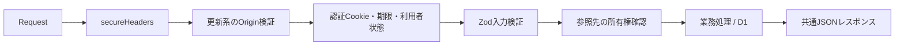

# 04. REST API設計

## 1. 基本方針

- ベースパスは `/api`、通信形式はHTTPS上のJSONとする。
- CSVエンドポイントだけ `text/csv` を返す。
- Honoでルーティングし、入力は `packages/validation` のZodスキーマで検証する。
- 認証必須APIはCookieセッションと `user_id` 所有権を検証する。
- 金額は円単位の安全な整数、日付は `YYYY-MM-DD`、対象年月は `YYYY-MM` とする。
- 一覧は原則ページングし、`pageSize` の上限は100とする。カテゴリーや利用者内の小規模マスターは100件上限で返す。
- 他利用者のIDは、存在していても原則404として返す。

## 2. 共通ミドルウェア

処理順は次のとおりです。



`/api/health`、`/api/auth/config`、`/api/auth/register`、`/api/auth/login` には認証を要求しません。登録は環境変数 `ALLOW_REGISTRATION=true` のときだけ許可します。個人用dev環境は初期アカウント作成時だけ一時的に有効化し、その後は `false` に戻します。

## 3. 共通レスポンス

### 3.1 成功

```json
{
  "data": {},
  "message": "OK"
}
```

作成は原則201、それ以外は200です。

### 3.2 ページング

```json
{
  "data": [],
  "meta": {
    "page": 1,
    "pageSize": 20,
    "total": 42,
    "totalPages": 3
  },
  "message": "OK"
}
```

`page>=1`、`1<=pageSize<=100`。既定値は `page=1&pageSize=20` です。

### 3.3 エラー

```json
{
  "error": {
    "code": "VALIDATION_ERROR",
    "message": "入力内容を確認してください。",
    "details": [
      { "path": "amountYen", "message": "0以上で入力してください。" }
    ]
  }
}
```

| HTTP | 用途 | 主なコード例 |
|---:|---|---|
| 400 | JSONとして読めない | `INVALID_JSON` |
| 401 | 未認証・期限切れ | `UNAUTHENTICATED` |
| 403 | 環境・Originなどで禁止 | `REGISTRATION_DISABLED`, `INVALID_ORIGIN` |
| 404 | APIまたは利用者所有データがない | `NOT_FOUND`, `HORSE_NOT_FOUND` |
| 409 | 現在状態・一意性・業務ルールと競合 | `STATEMENT_ALREADY_IMPORTED` など |
| 422 | Zod検証エラー | `VALIDATION_ERROR` |
| 500 | 想定外エラー | `INTERNAL_ERROR` |

各リクエストのログは `requestId`、`durationMs`、`errorType` だけを構造化して出力します。リクエスト本文、Cookie、パスワード、メール、個別の金額明細、例外メッセージは出しません。レスポンスには `x-request-id` を付けます。

## 4. 認証・初期設定

| Method | Path | 認証 | 説明 |
|---|---|---|---|
| GET | `/api/health` | 不要 | 環境名を含むヘルスチェック |
| GET | `/api/auth/config` | 不要 | 新規登録の許可状態を返す |
| POST | `/api/auth/register` | 不要 | `ALLOW_REGISTRATION=true` の場合だけ利用者登録とセッション開始 |
| POST | `/api/auth/login` | 不要 | パスワード検証とセッション開始 |
| POST | `/api/auth/logout` | 必要 | 現セッション削除とCookie消去 |
| GET | `/api/auth/me` | 必要 | 現利用者のID、メール、表示名、ロール、初期設定状態 |
| POST | `/api/setup` | 必要 | 予算、任意クラブ、初期カテゴリー・アラートを一括作成 |
| GET | `/api/setup/defaults` | 必要 | 初期設定画面用の既定値 |

Cookie名は `ham_session`、有効期間は14日です。トークン本体はCookieだけへ保存し、D1にはSHA-256ハッシュを保存します。

## 5. クラブ・カテゴリー・馬・出資・予算

### 5.1 クラブ

| Method | Path | 入力・クエリ | 動作 |
|---|---|---|---|
| GET | `/api/clubs` | `page`, `pageSize` | activeクラブを名称順で返す |
| POST | `/api/clubs` | name等 | 登録、監査ログ |
| PATCH | `/api/clubs/:id` | 部分更新 | 所有権確認後に更新、監査ログ |
| DELETE | `/api/clubs/:id` | なし | `status=archived`、監査ログ |

### 5.2 カテゴリー

| Method | Path | 入力・クエリ | 動作 |
|---|---|---|---|
| GET | `/api/categories` | `categoryType?` | activeを最大100件返す |
| POST | `/api/categories` | name, categoryType等 | 登録、親カテゴリー所有権確認 |
| PATCH | `/api/categories/:id` | 部分更新 | systemカテゴリーも含め所有権確認 |
| DELETE | `/api/categories/:id` | なし | `status=archived` |

### 5.3 馬

| Method | Path | 入力・クエリ | 動作 |
|---|---|---|---|
| GET | `/api/horses` | `page`, `pageSize`, `status?`, `clubId?`, `search?` | 現在名・旧名を含む一覧 |
| POST | `/api/horses` | 馬登録スキーマ | 候補馬・出資馬の共通登録 |
| GET | `/api/horses/:id` | なし | 馬、出資情報、旧名を返す |
| PATCH | `/api/horses/:id` | 部分更新 | 名前変更時は旧名を追加し、同じbatchで監査 |
| DELETE | `/api/horses/:id` | `{confirmationName}` | 完全一致後に関連データを物理削除 |

DELETEは厳格スキーマです。未知フィールドや空文字は422、現在名との不一致は409、他利用者の馬は404です。

### 5.4 出資

| Method | Path | 入力・クエリ | 動作 |
|---|---|---|---|
| GET | `/api/investments` | `horseId?` | 未アーカイブ出資を返す |
| POST | `/api/investments` | 出資条件、`initialCashflow?` | 出資・任意の初回支出・監査を一括保存 |
| PATCH | `/api/investments/:id` | 部分更新 | 契約情報を更新 |

`committedAmountYen` は `shares × unitPriceYen` と一致する必要があります。

### 5.5 予算

| Method | Path | 入力・クエリ | 動作 |
|---|---|---|---|
| GET | `/api/budgets` | `year?` | 指定年の年間・月間予算 |
| POST | `/api/budgets` | budgetType, periodKey, amountYen | 同一期間はupsert |
| PATCH | `/api/budgets/:id` | amountYen?, note? | 予算更新と監査 |
| GET | `/api/budgets/available-investment` | `year?` | 実績＋未払い予定を差し引いた出資可能額 |

## 6. 収支・予定・照合

### 6.1 実績収支

| Method | Path | 入力・クエリ | 動作 |
|---|---|---|---|
| GET | `/api/cashflows` | ページング、`targetMonth?`, `from?`, `to?`, `horseId?`, `clubId?`, `categoryId?`, `direction?` | 一覧 |
| GET | `/api/cashflows/:id` | なし | 詳細 |
| POST | `/api/cashflows` | 収支、`scheduledCashflowId?` | 実績と任意の照合を一括保存 |
| PATCH | `/api/cashflows/:id` | 部分更新 | 更新・監査 |
| DELETE | `/api/cashflows/:id` | なし | 既存照合を削除し `status=archived` |

### 6.2 定期ルール

| Method | Path | 入力・クエリ | 動作 |
|---|---|---|---|
| GET | `/api/recurring-rules` | `page`, `pageSize` | ルール一覧 |
| POST | `/api/recurring-rules` | ルール | 登録後、12か月先まで予定生成 |
| PATCH | `/api/recurring-rules/:id` | 部分更新 | 変更後の不足予定を補充 |
| DELETE | `/api/recurring-rules/:id` | なし | inactive化 |
| POST | `/api/recurring-rules/generate` | query `targetMonth?` | 指定月を起点に12か月先まで補充 |

生成は `ON CONFLICT(user_id, recurring_rule_id, due_on) DO NOTHING` で冪等です。

### 6.3 予定

| Method | Path | 入力・クエリ | 動作 |
|---|---|---|---|
| GET | `/api/scheduled-cashflows` | ページング、`targetMonth?`, `from?`, `to?`, `status?` | 予定一覧 |
| POST | `/api/scheduled-cashflows` | 予定入力 | 手動予定を登録 |
| PATCH | `/api/scheduled-cashflows/:id` | 部分更新、status? | 予定・状態を更新 |

### 6.4 照合

| Method | Path | 入力・クエリ | 動作 |
|---|---|---|---|
| GET | `/api/reconciliations` | `page`, `pageSize` | 照合一覧 |
| POST | `/api/reconciliations` | scheduledCashflowId?, cashflowId?, reason? | 1対1照合を作成 |
| PATCH | `/api/reconciliations/:id` | reason?, status? | 解決状態を更新 |
| DELETE | `/api/reconciliations/:id` | なし | 照合だけを解除し、実績を残して予定を期日に応じplanned/overdueへ戻す |
| POST | `/api/reconciliations/auto-match` | `targetMonth` | 対象月の未照合予定・実績を自動照合 |

一覧は予定・実績の件名、日付、金額、差額、判定理由を返します。作成・解除はD1 batchで予定状態、照合、監査ログを一括更新します。他利用者の照合や関連データは404です。

## 7. PDF帳票取込

| Method | Path | 説明 |
|---|---|---|
| GET | `/api/statement-imports/check?documentHash=<64桁SHA-256>` | 同一利用者の取込済み判定 |
| POST | `/api/statement-imports` | 取込記録と予定または実績を一括作成 |

POSTは次を検証します。

- `sourceType`: `lord` / `silk`
- `destination`: `scheduled` / `confirmed`
- 明細数: 1〜100
- 各明細の利用者所有クラブ、カテゴリー、任意の馬
- カテゴリー種別と支出・入金方向の一致
- 明細支出合計と `expectedExpenseYen` の一致
- 明細入金合計と `expectedIncomeYen` の一致
- `user_id + document_hash` と取込行キーの一意性

PDF本体や抽出全文を受け取るフィールドはありません。

## 8. 集計・分析・台帳

| Method | Path | 必須クエリ | 説明 |
|---|---|---|---|
| GET | `/api/dashboard/summary` | `targetMonth` | 月次・年次サマリーと通知 |
| GET | `/api/analytics/by-horse` | `from`, `to` | 馬別集計 |
| GET | `/api/analytics/by-club` | `from`, `to` | クラブ別集計 |
| GET | `/api/analytics/by-category` | `from`, `to` | カテゴリー別集計 |
| GET | `/api/analytics/monthly` | `from`, `to` | 月別集計 |
| GET | `/api/analytics/recovery-rates` | `from`, `to`, 任意フィルター | 回収率集計 |
| GET | `/api/calendar` | `from`, `to` | 期間内の予定 |
| GET | `/api/horses/:horseId/ledger` | `from?`, `to?` | 馬別台帳。未指定時は全期間 |

分析クエリは `horseId?`, `clubId?`, `categoryId?` を追加できます。`from<=to` を必須とします。

## 9. シミュレーション

| Method | Path | 説明 |
|---|---|---|
| GET | `/api/simulations` | activeシナリオをページング |
| POST | `/api/simulations` | シナリオ作成 |
| GET | `/api/simulations/:id` | シナリオと明細 |
| PATCH | `/api/simulations/:id` | シナリオ更新 |
| DELETE | `/api/simulations/:id` | statusをarchivedへ変更 |
| POST | `/api/simulations/:id/items` | 明細追加 |
| PATCH | `/api/simulations/:id/items/:itemId` | 明細更新 |
| DELETE | `/api/simulations/:id/items/:itemId` | 明細を物理削除 |
| GET | `/api/simulations/:id/result` | 負担額と年間予算比較 |

## 10. 引退・精算

| Method | Path | 説明 |
|---|---|---|
| GET | `/api/horses/:horseId/settlements` | 馬の精算一覧 |
| POST | `/api/horses/:horseId/settlements` | 精算予定登録 |
| POST | `/api/settlements/:id/complete` | 精算をcashflowへ反映し完了 |
| POST | `/api/horses/:horseId/mark-settled` | 未完了精算がない精算中の馬を完了へ |

`complete` はカテゴリー方向を精算の支出・入金方向と一致させ、`status='planned'` かつ `cashflow_id IS NULL` の場合だけ、実績作成・精算更新・監査ログを同じD1 batchで実行します。作成実績の `idempotency_key` は `settlement:<精算ID>` です。完了済みへの連続・同時リクエストは `409 / SETTLEMENT_ALREADY_COMPLETED` とし、実績と監査ログを追加しません。

## 11. 通知・アラート

| Method | Path | 説明 |
|---|---|---|
| GET | `/api/notifications` | 通知をページング |
| PATCH | `/api/notifications/:id/read` | 既読にする |
| GET | `/api/alert-rules` | 初期設定で作成されたルール一覧 |
| PATCH | `/api/alert-rules/:id` | 条件と有効状態を更新 |

MVPでは任意ルールの新規POSTは提供せず、利用者・種別ごとの既定ルールを更新します。

## 12. CSV出力

| Method | Path | 内容 |
|---|---|---|
| GET | `/api/export/cashflows.csv` | 収支明細 |
| GET | `/api/export/analytics-by-horse.csv` | 馬別集計 |
| GET | `/api/export/analytics-by-club.csv` | クラブ別集計 |
| GET | `/api/export/analytics-monthly.csv` | 月別集計 |
| GET | `/api/export/analytics-yearly.csv` | 年別集計 |

すべて `from`, `to` が必須で、期間は最大5年です。UTF-8 BOMを付与し、セルの先頭（空白を除く）が `=`, `+`, `-`, `@` の文字列にはアポストロフィを付けて数式としての解釈を防ぎます。引用符・改行を含むセルもRFC 4180形式でエスケープします。

## 13. 監査対象

少なくとも次の更新は `audit_logs` へ記録します。

- 登録・ログイン・ログアウト
- クラブ、カテゴリー、馬、出資、予算、収支、予定、ルール、精算の主要変更
- 馬名変更前の名前
- 馬の完全削除では詳細監査を消去し、匿名の削除件数監査へ置換

監査JSONでは `password`, `passwordHash`, `token`, `cookie` を `[REDACTED]` に置換します。
