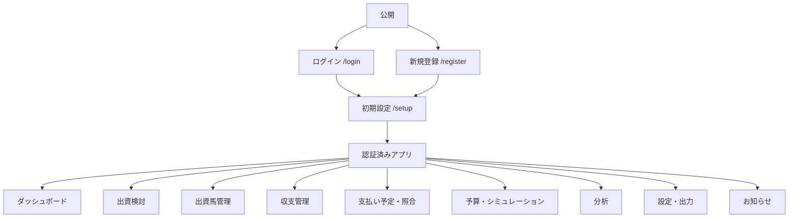
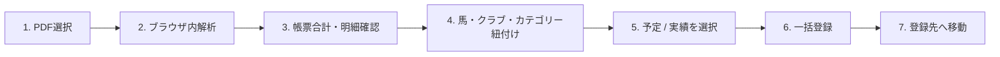

# 05. UI・画面設計

## 1. 基本方針

- PC利用を主とし、1024px以上では幅248pxの左サイドバーとメインコンテンツを使う。
- 1024px未満では上部ヘッダーと開閉式メニューを使う。
- 360px以上で主要操作を完了できるよう、狭い画面では表をカード・縦並びへ切り替える。
- 初心者が「予定」「実績」「予算」「出資可能額」の違いを理解できる日本語ラベルを使う。
- 金額は `￥12,345`、日付は日本時間を前提に表示する。
- 読込中、空状態、入力エラー、APIエラー、成功を明示する。

## 2. PCレイアウト

```text
┌──────────────────┬────────────────────────────────────────────┐
│ HORSE ASSET      │ ページタイトル / 説明 / 主要操作            │
│ 資金管理         ├────────────────────────────────────────────┤
│                  │                                            │
│ ダッシュボード    │ カード / グラフ / 表 / フォーム / 空状態     │
│ 出資検討          │                                            │
│ 出資馬管理        │ 最大幅1320px                               │
│ 収支管理          │                                            │
│ 支払い予定        │                                            │
│ 予算・出資計画    │                                            │
│ 分析              │                                            │
│ 設定              │                                            │
│                  │                                            │
│ 利用者・通知      │                                            │
│ ログアウト        │                                            │
└──────────────────┴────────────────────────────────────────────┘
```

## 3. ナビゲーション構造



## 4. 画面ルート

| パス | 画面 | 主な操作 | 実装コンポーネント |
|---|---|---|---|
| `/login` | ログイン | ログイン、新規登録への切替 | `AuthPage` |
| `/register` | 新規登録 | 許可中だけ表示。表示名、メール、12文字以上のパスワード | `AuthPage` |
| `/setup` | 初期設定 | 年間・月間予算、任意クラブを保存 | `SetupPage` |
| `/dashboard` | ダッシュボード | 月次サマリー、予定、通知、分析への導線 | `DashboardPage` |
| `/prospects` | 出資検討一覧 | 候補の検索、登録、編集、削除、出資確定 | `ProspectsPage` |
| `/prospects/new` | 候補馬登録 | 候補馬フォームを開く | `ProspectsPage` |
| `/horses` | 出資馬一覧 | 出資情報がある馬を確認 | `HorsesPage` |
| `/horses/:id` | 馬詳細 | 基本情報、出資、台帳、精算、名前変更、削除 | `HorseDetailPage` |
| `/horses/:id/ledger` | 馬別台帳 | 馬の支出・入金・損益・回収率 | `HorseDetailPage` |
| `/horses/:id/settlements` | 引退精算 | 予定・完了状態、反映済み収支、精算完了 | `HorseDetailPage` |
| `/cashflows` | 収支一覧 | 実績の絞込、登録、編集、アーカイブ、PDF導線 | `CashflowsPage` |
| `/cashflows/new` | 収支登録 | 実績入力フォームを開く | `CashflowsPage` |
| `/cashflows/import` | PDF取込 | 選択、解析、確認、紐付け、一括登録 | `StatementImportPage` |
| `/scheduled` | 支払い予定 | 予定、定期ルール、状態変更 | `SchedulePage` |
| `/calendar` | 支払カレンダー | 期間内予定を日付順に確認 | `SchedulePage` |
| `/reconciliations` | 予定・実績照合 | 自動・手動照合、差額・理由の確認、照合解除 | `SchedulePage` |
| `/budgets` | 予算・出資計画 | 年間・月間予算、出資可能額 | `BudgetsPage` |
| `/simulations` | シミュレーション | シナリオ一覧、作成、アーカイブ | `SimulationsPage` |
| `/simulations/:id` | シミュレーション詳細 | 候補追加、負担額・予算比較 | `SimulationsPage` |
| `/analytics` | 分析 | 期間・軸の変更、集計確認 | `AnalyticsPage` |
| `/settings/clubs` | クラブ設定 | 登録、編集、アーカイブ | `SettingsPage` |
| `/settings/categories` | カテゴリー設定 | 登録、編集、アーカイブ | `SettingsPage` |
| `/settings/alerts` | アラート設定 | 既定ルールの条件・有効状態 | `SettingsPage` |
| `/settings/export` | CSV出力 | 種類・期間を指定して出力 | `SettingsPage` |
| `/notifications` | お知らせ | 通知一覧、既読 | `NotificationsPage` |

未知のルートは `/dashboard` へ移動します。未認証は `/login`、初期設定未完了は `/setup` へ移動します。ログイン画面は `/api/auth/config` を参照し、`ALLOW_REGISTRATION=false` の環境では新規登録への切替を表示しません。

## 5. 主要画面仕様

### 5.1 ダッシュボード

表示する情報:

- 今月の実績支出、実績入金、差引
- 今月の未払い予定支出
- 年間予算、実績＋未払い予定の見込、残額
- 直近の予定と通知
- 期間限定の月別推移

実績と予定を同じ数値へ足し込む場合は「見込」と明記し、実績単独の数値と区別します。

### 5.2 出資検討・馬管理

一覧カードまたは表に、馬名、クラブ、状態、一口価格、予定口数、見込費用、締切を表示します。

馬詳細では次を扱います。

- 基本情報と募集情報
- 出資条件と初回支出
- 現在名の変更と以前の名前
- 実績台帳と回収率
- 引退・精算
- 状態変更
- 馬名完全一致による完全削除

完全削除ダイアログは次を満たします。

1. 削除が復元不能で、関連する金融データも消えることを表示する。
2. 現在の馬名を表示する。
3. 入力が完全一致するまで「完全に削除」を無効にする。
4. キャンセルとEscで閉じられる。
5. API側でも同じ確認を再検証する。

精算一覧は日本語の種類・状態、完了日、作成された収支IDを表示します。完了済みまたは取消済みの行は完了ボタンを無効化し、再操作による二重計上をUIでも防ぎます。

### 5.3 収支管理

入力項目:

- 支出 / 入金
- 内容
- 金額
- 発生日
- 対象年月
- カテゴリー
- 任意の馬・クラブ
- 任意の支払方法・メモ・予定との関連

一覧では対象月、期間、馬、クラブ、カテゴリー、種別で絞り込みます。アーカイブ済みは通常一覧と集計へ含めません。

### 5.4 支払い予定・照合

- 定期ルールの登録時に12か月先まで予定を生成する。
- 予定を日付・状態で確認し、手動予定も登録できる。
- 自動照合後に一致・差額・未実績・予定外実績を確認できる。
- 差額は正負と「実績 - 予定」の定義を画面に表示する。
- 未照合の予定ごとに金額と日付が近い実績候補、差額、候補にした理由を並べる。
- 手動照合後も予定・実績の件名、日付、金額、差額、判定理由を履歴で確認できる。
- 誤照合は「照合を解除」で戻す。実績は残し、予定は期日前なら「予定」、期日後なら「期限超過」へ戻す。

### 5.5 予算・シミュレーション

- 年間・月間予算を円で入力する。
- 年間予算、実績、未払い予定、見込、残額、出資可能額を分けて表示する。
- シミュレーションでは初回、月額、年額、初年度、期間合計を表示する。
- 予算超過時は色だけに頼らず文言・アイコンでも警告する。

### 5.6 PDF取込



登録ボタンは、次の全条件が満たされるまで無効にします。

- 対応帳票として解析できた。
- 支出・入金の明細合計が帳票合計と一致する。
- 全明細のクラブ、カテゴリー、必要な馬が確定している。
- 同じPDFが未登録である。
- 日付、対象年月、金額が妥当である。

### 5.7 分析・CSV

分析軸は馬、クラブ、カテゴリー、月です。期間指定を必須とし、支出、入金、差引、回収率を表示します。CSVは設定画面から最大5年の期間で出力します。

## 6. 状態・フィードバック

| 状態 | 表示方針 |
|---|---|
| 読込中 | 対象が分かる短いラベルとスピナー |
| 空 | 次に行う操作を1つ示す。例「候補馬を登録」 |
| 入力エラー | 項目の近くに日本語メッセージ、先頭エラーへ移動 |
| APIエラー | 操作結果と再試行方法を表示。内部エラー詳細は見せない |
| 成功 | 保存対象と結果が分かる短い通知 |
| 破壊的操作 | 専用ダイアログ、対象名、影響、取消導線 |

## 7. アクセシビリティ要件

- キーボードだけでナビゲーション、フォーム、ダイアログを操作できる。
- `label` と入力を関連付け、エラーをテキストで伝える。
- 見出し順を保ち、ページごとに主見出しを1つ置く。
- アイコンだけのボタンにアクセシブル名を付ける。
- 色だけで支出・入金・警告・状態を区別しない。
- ダイアログはフォーカスを閉じ込め、閉じた後に起点へ戻す。
- 表は見出しセルを持ち、狭い画面のカードでも項目名を省略しない。
- 動的な成功・エラーは支援技術へ通知する。

## 8. 対応ブラウザ・画面幅

| 対象 | 方針 |
|---|---|
| Edge / Chrome 現行版 | 正式対応 |
| 1024px以上 | 左サイドバー、表・複数列を優先 |
| 768〜1023px | 上部ヘッダー、開閉メニュー、列数削減 |
| 360〜767px | 縦並び、カード表示、44px以上の主要操作領域 |
| 360px未満 | MVP保証外 |

PlaywrightのCIはChromium、WindowsローカルではChromium・インストール済みChrome・Edgeを実行します。
