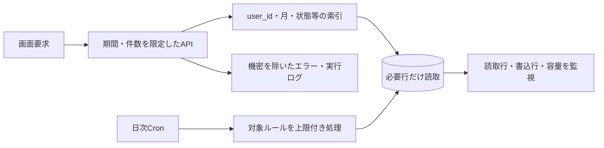

# 06. Cloudflare費用・制限設計

## 1. 前提

本書の価格・上限は2026-08-12時点の公式情報を確認したものです。Cloudflareの価格と含有量は変更され得るため、dev公開前・prod構築前・毎四半期に再確認します。

- [Workers Pricing](https://developers.cloudflare.com/workers/platform/pricing/)
- [D1 Pricing](https://developers.cloudflare.com/d1/platform/pricing/)
- [D1 Limits](https://developers.cloudflare.com/d1/platform/limits/)
- [D1 Time Travel](https://developers.cloudflare.com/d1/reference/time-travel/)
- [Workers Logs](https://developers.cloudflare.com/workers/observability/logs/workers-logs/)

## 2. 採用プラン

Cloudflare Workers Paid Planはアカウントあたり最低5 USD/月で、基本利用枠を超えると従量課金が発生します。「月額5 USDで無制限」ではありません。

現行MVPで課金対象になり得る主な要素は次のとおりです。

| 要素 | 利用 | 主な課金・監視単位 |
|---|---|---|
| Workers | API、SPA配信、Cron | リクエスト、CPU時間等 |
| D1 | 19テーブルの永続化 | 読取行、書込行、保存容量 |
| Workers Logs | devの観測性 | 保存・取得するログ量 |
| R2 | 未使用 | 将来の添付機能まで対象外 |

## 3. D1の現行目安

Workers Paidに含まれるD1の月次枠は、公式価格ページ上で次のとおりです。

| 指標 | Paidの月次含有量 | 超過時の公表単価 |
|---|---:|---:|
| 読取行 | 250億行 | 100万行あたり0.001 USD |
| 書込行 | 5,000万行 | 100万行あたり1.00 USD |
| ストレージ | 5 GB | 1 GB月あたり0.75 USD |

D1自体にデータ転送の追加料金はありませんが、D1を呼ぶWorkerの実行はWorkers側の使用量に含まれます。

Paidの主な技術上限には、1データベース10 GB、1 Worker呼出あたり最大1,000 D1クエリ、SQL実行30秒、1クエリ100バインド変数などがあります。現行MVPはこれらを目標値として使わず、十分小さい処理単位を維持します。

## 4. 構成上のコスト方針

### 4.1 読取コスト

- 一覧は `page` / `pageSize` を使い、最大100件とする。
- `user_id` と検索・集計条件を必ずSQLへ含める。
- ダッシュボードは対象月と当年など必要な期間だけを集計する。
- 分析APIは `from` / `to` を必須にする。
- CSVは最大5年とし、期間なしの全件出力を提供しない。
- `SELECT *` を避ける。ただし1件詳細など必要な場合は例外とする。
- D1の `rows_read` とクエリ時間を確認して索引を調整する。

### 4.2 書込コスト

- 画面再表示でDBを書き換えない。
- 定期予定は一意制約と `ON CONFLICT DO NOTHING` で重複生成しない。
- 通知は `dedupe_key` で同じ事象を重複生成しない。
- PDF取込は文書ハッシュと明細キーで重複を防ぐ。
- 複数更新はD1 batchでまとめるが、1回の巨大batchを作らない。
- 監査ログには必要な変更だけを保存し、PDF全文や巨大JSONを保存しない。

### 4.3 ログコスト・情報保護

- devでは `observability.enabled=true` を使用する。
- 本番相当ログにはパスワード、Cookie、トークン、リクエスト本文、PDF文字列、個別金額明細を出さない。
- 通常成功リクエストを無条件に全件カスタムログへ出さない。
- 例外は構造化し、環境、処理種別、エラーコード、相関IDなど非機密情報で絞り込めるようにする。
- 保持期間とサンプリングはprod設計時に決める。

## 5. Cron設計

現行Cronは `15 0 * * *`、UTC 0:15 / 日本時間9:15の日次1回です。

1. 期限超過予定の更新
2. 有効な定期ルールを最大200件取得
3. 各ルールを12か月先まで補充
4. 期限切れセッション削除
5. 有効アラートルールを最大500件取得
6. 各種通知候補を上限付きで取得

運用時に対象が上限を超えた場合、処理頻度を上げる前にカーソル・分割処理と処理遅延の可視化を設計します。

## 6. 予算アラート

Cloudflare BillingのBudget alertsへ、少なくとも次を設定します。

| 通知 | 目的 |
|---|---|
| 7 USD | 最低月額を超える傾向の早期確認 |
| 10 USD | 想定外増加の調査・変更停止判断 |

Budget Alertは利用停止上限ではなく通知です。WorkerのCPU上限、APIのページング、期間制限、定期処理上限を併用します。

## 7. 使用量監視

| 指標 | 確認頻度 | 警戒条件の初期案 | 対応 |
|---|---|---|---|
| Workersリクエスト | 週次 / リリース翌日 | 通常週の2倍 | ループ・再試行・botを確認 |
| Worker CPU時間 | 週次 | p95の継続上昇 | 重い集計とPDF以外のCPU処理を調査 |
| D1 rows_read | 週次 | 利用者増以上の急増 | 全件走査、欠落索引、画面再取得を調査 |
| D1 rows_written | 週次 | Cron後の異常増加 | 冪等性、監査量、重複操作を確認 |
| D1容量 | 月次 | 増加率が想定を超過 | 保持対象・不要データ・索引を確認 |
| Cron成否 | 日次 | 1回失敗、処理上限到達 | 手動実行可否と次回補完を確認 |
| 5xx | 日次 | 連続または急増 | 直近リリース、D1過負荷、外周設定を確認 |

実利用前にベースラインを計測し、固定の絶対値より利用者数・データ量あたりの傾向で判断します。

## 8. D1制限を踏まえた実装ルール

- 1データベースは書込を直列処理するため、長時間トランザクションや巨大更新を避ける。
- 大量更新・削除は一括SQLへせず、明示した小さい単位へ分割する。
- インデックスは読取を減らすが書込行数と容量を増やすため、利用クエリに合わせる。
- 1 APIで多数の独立D1呼出を行うN+1を避ける。
- PDF明細は最大100件、Cronのルールは1回最大200件として上限を持つ。
- D1エラー時に無制限再試行しない。更新APIをクライアント側で自動再送する場合は冪等キーを検討する。

## 9. 復旧とコスト

Workers PaidのD1 Time Travelは、対応ストレージで過去30日間の任意の分への復旧を提供します。追加の履歴保存・復旧料金は公式文書上不要ですが、復旧操作自体の検証と権限管理は必要です。

- devでTime Travelの利用可否とD1 `version` を確認する。
- マイグレーション前に復旧基準時刻またはbookmarkを記録する。
- 本番で30日を超える保持が必要な場合は、暗号化・アクセス制御・削除方針を定めた別バックアップを設計する。
- 馬の明示的な完全削除をバックアップから任意復元する機能は提供しない。法的・運用上の保持方針はprod前に決定する。

## 10. コスト事故時の対応

1. 新規デプロイとCron手動実行を停止する。
2. Workers、D1、Logsのどの指標が増加したか分離する。
3. `wrangler tail --env dev` と直近リリース差分を確認する。
4. 無限再試行、全件走査、重複生成、botアクセスを優先調査する。
5. 必要なら直前バージョンへWorkerをロールバックする。
6. D1に不正な重複がある場合は件数・影響を確認し、復旧または修正マイグレーションを用意する。
7. 原因と再発防止を `12_decisions_and_open_issues.md` またはインシデント記録へ残す。
