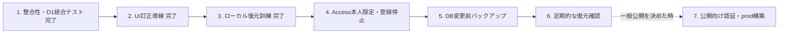

# 07. 実装状況・ロードマップ

## 1. 現在地

2026-08-12時点でMVPの主要機能と、自分専用で安定運用するための整合性・復旧改善を実装済みです。当面はCloudflare Accessで本人だけに限定したdev環境を利用し、一般公開向けの認証・規約・prod構築は延期します。

| フェーズ | 内容 | 状態 |
|---|---|---|
| 0 | 開発環境・Cloudflare準備 | devまで完了 |
| 1 | monorepo、React、Worker、Tailwind、Drizzle、Zod | 完了 |
| 2 | 19テーブル、マイグレーション、ローカルseed | 完了 |
| 3 | 認証、初期設定、クラブ、カテゴリー、馬、出資、予算API | 完了 |
| 4 | 収支、定期ルール、予定、照合API | 完了 |
| 5 | 集計、台帳、回収率、シミュレーション、精算、通知、CSV | 完了 |
| 6 | PC・モバイル対応UI | 主要画面完了 |
| 7 | PDF帳票取込、馬名履歴、完全削除 | 完了 |
| 8 | 単体・API・D1統合・Chrome/Edge E2E、devデプロイ | 安定運用対象は完了 |
| 9 | 一般公開準備 | 方針により延期 |

## 2. 実装済み機能

- メール・パスワード認証、14日間のCookieセッション
- 初回予算、クラブ、標準カテゴリー、アラート条件の設定
- 候補馬・出資馬、旧名、出資契約、初回支出
- 馬名完全一致による関連金融データの完全削除
- 実績支出・入金、定期ルール、12か月先予定、期限超過
- 予定・実績の手動登録、自動照合、候補比較、差額、照合解除
- 年間・月間予算、出資可能額、出資シミュレーション
- ダッシュボード、馬別台帳、各軸分析、回収率
- 再実行・同時実行を防ぐ引退精算、アプリ内通知、BOM・式注入対策済みCSV出力
- シルク・ロードの対応PDFをブラウザ内解析して一括登録
- Cloudflare devの単一Worker配信、D1、日次Cron、Workers Logs
- 主要APIの利用者分離、Zod、監査ログ、TypeScript strict
- `ALLOW_REGISTRATION` による初期登録後の自己登録停止
- Miniflare隔離D1でのマイグレーション、ロールバック、重複、集計一致の統合テスト
- Windows用D1バックアップ・新規ローカルD1復元スクリプト
- リクエストID、処理時間、エラー種別だけの構造化Workerログ

## 3. 本番前バックログ

### P0: 整合性・復旧と一般公開の境界

| ID | 作業 | 状態 | 完了条件 |
|---|---|---|---|
| BL-P0-01 | 精算完了APIの再実行防止 | 完了 | 状態条件、冪等性キー、409、連続・同時統合テスト |
| BL-P0-02 | D1 batchの原子性・制約統合テスト | 完了 | 出資＋初回支出、PDF取込、定期予定生成、精算完了の失敗注入で全体ロールバック |
| BL-P0-03 | 認証の一般公開化 | 延期 | メール確認、パスワード再設定、レート制限。個人利用中はAccess＋登録停止を使用 |
| BL-P0-04 | CSRF・CSP・Cookie最終確認 | 一般公開まで延期 | HTTPS環境で更新系Origin、Cookie属性、CSPをテスト |
| BL-P0-05 | バックアップ・復旧訓練 | ローカル完了、remote手動確認 | 日時付きSQLを新規ローカルD1へ復元済み。dev Time TravelはAccess設定後に実施 |
| BL-P0-06 | prod分離 | 延期 | 一般公開時に専用Worker、D1、ドメイン、Secret、Budget Alertを構築 |

### P1: 品質と運用性

| ID | 作業 | 状態 | 完了条件 |
|---|---|---|---|
| BL-P1-01 | 手動照合UI改善 | 完了 | 候補、予定・実績、差額、理由、解除/再照合を表示 |
| BL-P1-02 | 精算UI改善 | 完了 | 状態、実績反映済み、精算完了可否を明示 |
| BL-P1-03 | 大量データ試験 | 継続 | 5年CSV、ページング、分析、Cron上限でタイムアウトしない |
| BL-P1-04 | アクセシビリティ監査 | 継続 | キーボード、ラベル、エラー、コントラスト、ダイアログに重大問題がない |
| BL-P1-05 | Chrome/Edge実機E2E | 完了 | WindowsのChrome/Edgeで登録、編集、照合、精算、削除が通る |
| BL-P1-06 | 観測性 | 個人運用分完了 | 機密を含まないリクエストログと確認手順。外部通知は一般公開時に追加 |
| BL-P1-07 | CSV安全性 | 完了 | UTF-8 BOM、改行・引用符、式注入をD1統合テストで確認 |

### P2: 公開後候補

- 外部IdPまたはパスキー
- 利用者自身によるアカウント・全データ削除
- 監査ログの管理画面または安全なエクスポート
- 対応帳票の追加。ただし端末内解析と明示確認を維持する
- R2添付ファイル。PDF取込とは別の同意・保持機能として設計する
- メール通知、ブラウザ通知
- PWA

## 4. 実装しない機能

以下はロードマップへ追加しません。

- レース・馬券予想
- 血統・調教・馬体評価
- 推奨出資馬判定
- 獲得賞金予測
- 競馬ニュースやレース結果の自動収集
- 資金実績と根拠のない投資助言

## 5. 推奨実施順

## 6. リリース品質ゲート

### コード

- `npm.cmd run typecheck`
- `npm.cmd run lint`
- `npm.cmd run format:check`
- `npm.cmd test`
- `npm.cmd run test:integration`
- `npm.cmd run build`
- `npm.cmd run test:e2e`

すべて終了コード0を必須とします。

### DB

- 全マイグレーションが新規D1と既存dev D1の両方へ適用できる。
- `PRAGMA foreign_key_check;` が0件。
- アプリ用テーブルが19件。
- 一意制約、チェック制約、batch失敗時挙動の統合テストが通る。

### セキュリティ

- 2利用者の主要APIデータ分離D1統合テストが通る。
- HTTPSでSecure/HttpOnly/SameSite Cookieを確認する。
- 更新系のクロスオリジン要求を拒否する。
- ログへパスワード、Cookie、トークン、PDF本文、個別明細が出ない。
- 個人利用ではAccess本人限定と `ALLOW_REGISTRATION=false` を確認する。レート制限・公開向け認証・CSP最終化は一般公開時のゲートとする。

### 業務整合性

- ダッシュボード、台帳、分析、CSVの実績集計元が `cashflows` で一致する。
- 回収率と出資可能額が共通関数の定義と一致する。
- PDFと定期予定の再実行で重複しない。
- 精算完了の再実行で実績が増えない。
- 馬の完全削除範囲と匿名監査が要件どおりである。

### 運用

- Budget Alert、Workers Logs、Cron、D1メトリクスを確認できる。
- 日時付きSQLバックアップを新しいローカルD1へ復元し、`foreign_key_check` が0件である。
- dev D1変更前はSQLバックアップを取得し、Time Travelのbookmark/時刻を記録する。
- 一般公開時はWorkerロールバックとD1 Time Travelをdevで訓練し、prodをdevと分離する。

## 7. 完了の定義

1つのバックログ項目は、実装だけでなく次が揃ったときに完了とします。

- 要件または設計書が更新されている。
- 正常系・境界値・権限・失敗時のテストがある。
- 必要な監査ログと運用確認手順がある。
- UI変更ならChrome/Edgeと狭い画面を確認している。
- DB変更ならマイグレーションと復旧手順がある。
- `11_requirements_traceability.md` が更新されている。
