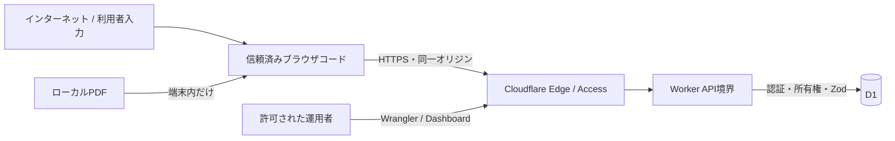

# 08. セキュリティ・データ保護設計

## 1. 目的

本書は、一口馬主の資金・個人情報を扱う本サービスの保護境界、実装済み対策、残存リスク、本番前の必須対応を定義します。

## 2. 保護対象

| 区分 | 例 | 機密度 | 主な保護要件 |
|---|---|---:|---|
| 認証秘密 | パスワード、セッションCookie | 最高 | 平文保存・ログ出力禁止、HTTPS、期限、失効 |
| 個人情報 | メール、表示名、IP | 高 | 利用目的限定、アクセス制御、保持・削除方針 |
| 資金情報 | 支出、入金、予算、出資、精算 | 高 | 利用者分離、整合性、監査、復旧 |
| 馬・クラブ情報 | 馬名、旧名、クラブ、メモ | 中〜高 | 利用者分離、削除範囲、メモへの機密入力注意 |
| PDF帳票 | 氏名、住所、口座、明細全文を含み得る | 最高 | 端末外送信禁止、保存禁止、明示確認 |
| 運用情報 | ログ、D1 ID、環境設定 | 中〜高 | 最小権限、秘密値の分離、監査 |

## 3. 信頼境界

ブラウザ、API、DBの各境界で入力と所有権を再検証し、UIだけの制御へ依存しません。

## 4. 現行の認証設計

### パスワード

- 登録時は12〜128文字。
- 16バイトのランダムsaltを使用する。
- PBKDF2-HMAC-SHA-256、100,000回、256bitで派生する。
- 保存形式はアルゴリズム、版、反復回数、salt、ハッシュを含む。
- 比較は長さ確認後に全バイトの差分を集約し、単純な文字列早期終了を避ける。

100,000回は現行Cloudflare Workers Web Cryptoの制約に合わせた実装値です。本番前に負荷試験と最新の推奨を確認し、外部IdPやより強い認証方式への移行も検討します。

### セッション

- Cookie名: `ham_session`
- 32バイトのランダムトークンをBase64URL化する。
- D1にはトークンのSHA-256だけを保存する。
- 有効期間は14日。
- `HttpOnly`, `SameSite=Lax`, `Path=/`。
- 非local環境では `Secure`。
- ログアウトで現在のD1セッションとCookieを削除する。
- 日次処理で期限切れセッションを削除する。

現行の `last_used_at` は発行時に設定するだけで更新していません。アイドルタイムアウトではなく絶対有効期限です。

### 個人利用時の登録制御

- Worker環境変数 `ALLOW_REGISTRATION` が文字列 `true` の場合だけ自己登録を許可する。
- `/api/auth/config` は登録可否だけを返し、Webは無効時に新規登録導線を表示しない。
- localは開発用に `true`、devは初期アカウント作成時だけ一時的に `true` とし、作成後は `false` へ戻す。
- devの外周はCloudflare AccessのAllowメールを本人のみに限定する。

## 5. 認可・利用者分離

- 主要テーブルに `user_id` を持たせる。
- APIは認証利用者をサーバー側Cookieから決定し、リクエスト本文の `user_id` を受け付けない。
- 馬、クラブ、カテゴリーなどの参照先を利用者ID付きで取得する。
- 更新・削除SQLも `id AND user_id` を条件とする。
- 他利用者の既知IDを指定されても原則404とし、存在を開示しない。
- Miniflare隔離D1の2利用者テストで、馬、精算、収支、クラブ、カテゴリー、出資、予算、定期ルール、予定、照合、シミュレーション・明細、通知、アラート、PDF取込判定の分離を確認する。

主要リソースは他利用者のIDに対して404を返します。新しいネストAPIを追加した場合は同じ所有権マトリクスへ必ず追加します。

## 6. 入力・出力保護

### 入力

- 共有Zodスキーマで型、長さ、形式、列挙、整数、安全範囲、未知フィールドを検証する。
- 日付は形式だけでなく実在日を検証する。
- 金額は非負の安全な整数とする。
- DrizzleのバインドまたはD1 prepared statementを使い、文字列連結SQLを避ける。
- 所有権とカテゴリー方向など、型だけで表せない業務制約をAPIで検証する。
- 重要な非負・正数・一意性はDB制約でも守る。

### 出力

- APIエラーは内部スタック、SQL、秘密値を返さない。
- Reactの通常レンダリングで文字列を表示し、任意HTML挿入を避ける。
- CSVはUTF-8 BOMを付け、引用符・改行をエスケープし、空白を除いた先頭が `=`, `+`, `-`, `@` の文字列へアポストロフィを付けて式注入を防ぐ。D1統合テストで確認する。
- CookieやパスワードをAPIレスポンスへ含めない。

## 7. Webリクエスト保護

### 実装済み

- Hono `secureHeaders()` を全ルートへ適用する。
- GET/HEAD/OPTIONS以外で `Origin` を確認し、要求URLと異なるhostを403にする。
- localだけlocalhost/127.0.0.1間を許可する。
- `SameSite=Lax` Cookieを使用する。
- 非localではHTTPS前提のSecure Cookieを使用する。
- dev外周はCloudflare AccessのAllowメールで制限する。
- `ALLOW_REGISTRATION=false` で初期登録後の自己登録を停止できる。

### 本番前に確認・追加

- 明示的なContent Security Policyを資産・PDF.js・グラフを含めて検証する。
- `Origin` が欠落する更新要求の扱いを決め、CSRFトークンまたはFetch Metadata検証を追加検討する。
- 登録、ログイン、PDF取込、CSV、破壊的操作へレート制限を追加する。
- Cloudflare Accessはアプリ認証の代わりではなく、dev外周保護として維持する。
- カスタムドメイン、HSTS、TLS設定をprodで確認する。

## 8. PDFプライバシー

### データ最小化

ブラウザからAPIへ送るのは次だけです。

- 帳票種別
- 取込先（予定/実績）
- PDFのSHA-256
- 対象年月
- 帳票上の支出・入金合計
- 利用者が確認した最大100件の業務明細

次は送信・保存しません。

- PDFファイル本体
- 抽出した全文・文字座標
- 帳票の氏名、住所、口座番号
- ブラウザで表示した未選択行

### 検証

- ブラウザのNetworkでmultipartやPDF byte列が送られないことを確認する。
- APIスキーマにファイル・全文フィールドがないことを静的確認する。
- D1の `statement_imports` がハッシュ、種別、対象月、件数だけであることを確認する。
- Workerログに取込本文を出さない。

## 9. 監査ログ

監査対象は認証、クラブ、カテゴリー、馬、出資、予算、収支、予定、ルール、精算などの重要変更です。

- `user_id`, action, entity type/id, 対象馬ID、変更JSON、IP、日時を保持する。
- `password`, `passwordHash`, `token`, `cookie` は `[REDACTED]` に置換する。
- PDF取込監査へ個別の金額や全文を保存しない。
- ログ閲覧APIはMVPにない。D1への運用アクセス権を限定する。

馬の完全削除では、馬に紐づく詳細監査も消去し、匿名のテーブル別削除件数だけを残します。この例外は利用者の明示削除を優先する設計判断です。

Workerの実行ログは監査ログと分離し、`requestId`、`durationMs`、`errorType` だけを構造化して記録します。個人情報、金額、本文、例外メッセージは出力せず、レスポンスの `x-request-id` と突き合わせて調査します。

## 10. 脅威と対策

| 脅威 | 影響 | 現行対策 | 残対応 |
|---|---|---|---|
| 認証総当たり | 不正ログイン | 12文字以上、ハッシュ、Access(dev) | IP/アカウントレート制限、通知 |
| セッション窃取 | 全データ閲覧 | HTTPS、HttpOnly、Secure、ハッシュ保存 | CSP、端末一覧、全ログアウト |
| CSRF | 不正更新・削除 | SameSite Lax、Origin確認 | 欠落Origin方針、追加トークン検討 |
| IDOR | 他利用者データ漏えい | `user_id`条件、404、主要API所有権マトリクス | 新規API追加時の回帰 |
| SQLインジェクション | 漏えい・改ざん | バインド、Drizzle、Zod | 動的SQLレビュー継続 |
| XSS | セッション悪用 | Reactエスケープ、secure headers | CSP、メモ・CSVの攻撃テスト |
| CSV式注入 | Excelで任意式 | BOM、引用、セル先頭安全化、統合テスト | 表計算ソフト更新時の回帰 |
| PDF情報漏えい | 高機密漏えい | 端末内解析、API最小化 | Network/ログ回帰テスト |
| 重複実行 | 金額二重計上 | 精算状態条件、冪等性キー、一意制約、batch、連続・同時テスト | 新規金額操作への展開 |
| 誤削除 | 履歴消失 | 馬名完全一致、影響表示 | 復旧・保持方針、操作監査 |
| ログ漏えい | 認証・資金情報漏えい | requestId・処理時間・エラー種別だけの構造化ログ | Workers Logsの定期監査 |
| 依存関係脆弱性 | 実行・漏えい | lockfile、CI予定 | 依存監査、更新周期、SBOM検討 |
| コスト攻撃 | 高額請求・停止 | ページング、上限、Budget Alert | WAF/レート制限、CPU上限 |

## 11. データ保持・削除

現行MVPの保持方針:

- 業務収支: 利用者がアーカイブしても履歴保持。
- セッション: 期限切れを日次削除。
- 通知: 自動削除期間は未定。
- 監査: 自動削除期間は未定。
- PDF: 本体・全文を保持しない。ハッシュと取込メタだけ保持。
- 馬: 明示的な完全削除時に関連データを復元不能として削除。

prod前に、退会時の全データ削除、監査・通知の保持期間、バックアップ中の削除反映、法的要求への対応を決定します。

## 12. セキュリティ品質ゲート

- [ ] 登録・ログインのレート制限がある
- [ ] メール確認・パスワード再設定の安全なフローがある
- [ ] Cookie属性とOrigin/CSRFをHTTPS環境でテストした
- [ ] CSPを有効化し主要画面・PDF解析が動作する
- [x] 主要APIの他利用者アクセス試験がある
- [x] 精算完了を含む更新APIの再実行・同時実行試験がある
- [ ] PDF本体・全文がNetwork、D1、ログに存在しない
- [x] CSVのBOM・式注入と主要境界値をテストした（XSS手動監査は継続）
- [ ] D1/Cloudflareの運用権限とMFAを確認した
- [ ] Secretをリポジトリへ保存していない
- [x] Workerカスタムログを非機密3項目へ限定した（実環境tail確認は運用時に実施）
- [ ] 依存関係と既知脆弱性をリリース時に確認した
- [ ] インシデント対応と利用者通知の責任者が決まっている
