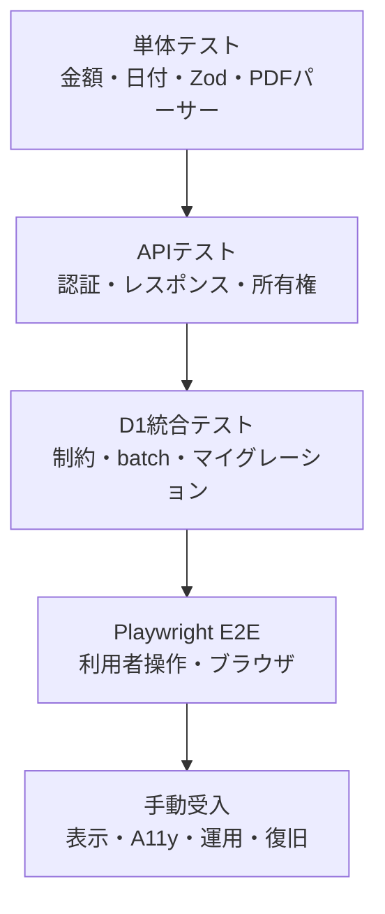

# 09. テスト・受入計画

## 1. 目的

資金管理の正確性、利用者分離、冪等性、破壊的操作、対象ブラウザを、再現可能な自動テストと手動受入で確認します。

## 2. テスト方針



単体テストだけで金額の正しさを保証せず、DB保存、API集計、画面、CSVが同じ定義を使うことを縦断確認します。

## 3. 現在の自動テスト

| レイヤー | 主な対象 | 現状 |
|---|---|---|
| shared単体 | 金額表示、予算、回収率、馬状態、日付、予定生成 | 実装済み |
| validation単体 | Zod入力、境界値、strict入力 | 実装済み |
| API単体 | health、登録可否設定、登録停止、Origin、レスポンス | 実装済み |
| password単体 | PBKDF2保存・検証 | 実装済み |
| PDFパーサー単体 | 対応帳票の解析 | 実装済み |
| E2E | 登録〜出資〜収支、馬編集、照合・解除、精算、冪等性、馬完全削除 | Chromium / Chrome / Edge用に実装済み |
| D1統合 | 全migration、batch失敗注入、所有権、重複、集計・CSV一致 | Miniflare隔離D1で実装済み |

## 4. 標準コマンド

```powershell
npm.cmd run typecheck
npm.cmd run lint
npm.cmd run format:check
npm.cmd test
npm.cmd run test:integration
npm.cmd run build
npm.cmd run test:e2e
```

Playwrightブラウザがない場合だけ `npx.cmd playwright install chromium` を実行します。CIはChromium、WindowsローカルはChromium・Chrome・Edgeを対象にします。

## 5. 機能別テストマトリクス

| 対象 | 正常系 | 境界・異常系 | 権限・再実行 |
|---|---|---|---|
| 登録・ログイン | 登録、ログイン、ログアウト | 重複メール、11文字、誤パスワード、期限切れ | 本番登録禁止、総当たり制限 |
| 初期設定 | 予算・クラブ・初期マスター | 0円、未知フィールド、二重実行 | 他者データなし、冪等性 |
| 馬 | 登録、検索、編集、旧名 | 不正日付、負額、長文、状態全値 | 他者404、旧名重複なし |
| 出資 | 口数×一口価格、初回支出 | 0口、不一致総額、上限超過 | 1馬1件、batch失敗 |
| 収支 | 支出・入金、編集、絞込 | 負数、小数、方向不一致、無効ID | 他者404、アーカイブ後非集計 |
| 定期予定 | 毎月・毎年・一回、月末丸め | 2/29、31日、終了月、無効化 | 2回生成で件数不変 |
| 照合 | 一致、差額、未実績、予定外、解除 | 片側なし、同じ予定/実績の再利用、期限超過へ復帰 | 他者ID、自動照合再実行、他者解除404 |
| 予算 | 年・月、見込、残額 | 0円、未設定、超過 | 他者予算なし、upsert |
| 分析 | 各軸、回収率、期間 | 分母0、期間逆転、取消混在 | 他者混入なし、実績だけ集計 |
| シミュレーション | 初回、月額、年額、期間 | 1/12/13/120か月、0件 | 他者馬、アーカイブ非表示 |
| 精算 | 予定、支出/入金完了、馬完了 | 方向不一致、未完了あり | 同じ完了を2回拒否、他者404 |
| 通知 | 期限、締切、予算、未入力、集中 | 境界日、閾値ちょうど、不正条件JSON | dedupe、他者既読不可 |
| PDF取込 | silk/lord、予定/実績 | 合計不一致、100/101件、未対応PDF | 同一hash拒否、他者マスター拒否 |
| CSV | 収支、馬、クラブ、月、年 | 0件、5年、5年超、日本語・改行 | 他者混入なし、式注入安全化 |
| 馬削除 | 候補馬・出資馬の完全削除 | 空、不一致、未知フィールド | 他者404、匿名監査だけ残る |

## 6. 主要E2E受入シナリオ

### E2E-01 初回利用から実績登録

1. 新規登録する。
2. 初期設定を完了する。
3. 候補馬を登録する。
4. 出資と初回支出を登録する。
5. 維持費を登録する。
6. 馬別台帳とダッシュボードの金額を確認する。

期待結果: 出資契約額は実績に自動重複せず、登録した初回支出と維持費だけが実績支出へ入る。

### E2E-02 利用者分離

1. 利用者Aで馬・収支・予定・精算を作成する。
2. 利用者Bでログインする。
3. AのIDを使って各GET/PATCH/DELETEを行う。

期待結果: すべて404または認可エラーとなり、一覧・分析・CSVにも混入しない。

### E2E-03 月次予定と照合

1. 31日指定の月次ルールを登録する。
2. 12か月先までの予定を確認する。
3. 同じ生成APIを再実行する。
4. 実績を登録し照合する。

期待結果: 短い月は月末、再実行しても重複せず、差額が `実績-予定` と一致する。

### E2E-04 PDF取込

1. 対応PDFを選択する。
2. 帳票合計、明細、紐付けを確認する。
3. 実績へ登録する。
4. 同じPDFを再度選択する。

期待結果: 1回目だけ登録され、PDF本体・全文がHTTP要求とD1に含まれない。

### E2E-05 引退精算

1. 馬を精算中へ変更する。
2. 支出と入金の精算予定を作る。
3. 各精算を完了する。
4. 同じ精算完了要求を再送する。
5. 馬を精算完了にする。

期待結果: 各精算は実績へ1件だけ反映され、再送は409、未完了中は馬を完了にできない。

### E2E-06 馬の完全削除

1. 出資、実績、ルール、予定、照合、精算、シミュレーション明細を持つ馬を用意する。
2. 不一致名・未知フィールド・他利用者で削除を試す。
3. 現在名を完全一致入力して削除する。

期待結果: 事前の要求は失敗し、完全一致時だけ関連データが消える。シナリオ本体は残り、匿名件数監査に馬名・ID・金額がない。

## 7. 金額整合性テスト

共通の固定データでAPI、画面、CSVを比較します。

| データ | 金額 |
|---|---:|
| 出資契約元本 | 100,000円 |
| 確定した初回支出 | 100,000円 |
| 確定維持費 | 20,000円 |
| 取消支出 | 5,000円 |
| 未払い予定 | 30,000円 |
| 確定入金 | 60,000円 |
| 年間予算 | 200,000円 |

期待値:

- 実績支出 = 120,000円
- 実績入金 = 60,000円
- 差引損益 = -60,000円
- 馬代回収率 = 60.0%
- 総合回収率 = 50.0%
- 見込支出 = 150,000円
- 年間予算残額 = 50,000円
- 出資可能額 = 50,000円

取消支出と出資契約元本を実績支出へ追加しません。

## 8. D1統合テスト実装

`apps/api/tests/d1.integration.test.ts` はテストごとにMiniflareの隔離D1を作成し、`migrations/` を順番に適用します。実装済みの確認範囲は次のとおりです。

- 19アプリテーブル、全マイグレーション、D1 batchの基本ロールバック
- 出資＋初回支出、PDF取込、定期予定ルール作成・予定生成、精算完了へのトリガー失敗注入と全体ロールバック
- 精算完了の連続・同時リクエストで200と409が1件ずつになり、実績・監査が重複しないこと
- PDF再取込と定期予定再生成で件数が増えないこと
- 照合解除で実績を残し、予定を期日に応じてplanned/overdueへ戻すこと
- 2利用者による主要リソースの参照・更新・解除・精算完了が404になること
- 固定収支に対するダッシュボード、馬別台帳、月別分析、CSVの支出・入金・差引一致
- CSVのUTF-8 BOMと数式先頭安全化

追加のDB制約境界、大量データ、馬完全削除の失敗注入は継続回帰項目です。

## 9. 非機能試験

### 性能・コスト

- 1利用者あたり馬100件、収支10,000件、予定5,000件、通知1,000件の試験データ。
- 一覧は100件以内でページングされる。
- ダッシュボード・分析・5年CSVがCloudflare制限内で完了する。
- D1 `rows_read`、`rows_written`、SQL時間を記録する。
- Cron上限到達時の残処理と次回補完を確認する。

### アクセシビリティ

- キーボードのみの主要操作。
- フォーカス順・見えるフォーカス。
- フォームラベル、エラー関連付け、ライブ通知。
- ダイアログのフォーカストラップと復帰。
- コントラスト、200%ズーム、360pxリフロー。

### セキュリティ

- 未認証、他利用者ID、未知フィールド、境界値。
- クロスオリジン更新要求。
- Cookie属性、セッション期限、ログアウト。
- XSS文字列、CSV式、ログへの機密情報。
- 同一操作の再送と並行送信。

## 10. テストデータ方針

- 実在の利用者、馬、口座、クラブ帳票を自動テストへ含めない。
- メールは `example.test`、馬名は明確なテスト名を使う。
- PDF fixtureは個人情報を除いた合成帳票とし、利用許諾を確認する。
- 時刻依存テストは日本時間と固定日時を注入する。
- 金額境界は0、1、安全整数上限付近、負数、小数を含める。
- テスト後のremote devデータは明示した手順で削除する。local DBの再作成と混同しない。

## 11. 不具合の優先度

| 優先度 | 例 | リリース判定 |
|---|---|---|
| P0 | 他利用者漏えい、金額二重計上、認証回避、データ消失 | 1件でも不可 |
| P1 | 主要フロー不能、誤集計、PDF誤登録、Edgeで操作不能 | 1件でも原則不可 |
| P2 | 回避可能なUI不備、軽微なA11y、低頻度エラー | 期限・回避策付きで判断 |
| P3 | 文言、余白、非主要表示 | バックログ可 |

## 12. 受入完了条件

- P0/P1が0件。
- コード品質コマンドがすべて成功。
- 主要E2E-01〜06がChrome/Edge相当で成功。
- D1統合テストが成功。
- 金額固定データのAPI・UI・CSVが一致。
- 個人利用向けセキュリティ品質ゲートとローカル復元訓練が完了。dev Time Travelは実DB変更前に実施する。
- 要件トレーサビリティに未説明の空欄がない。
