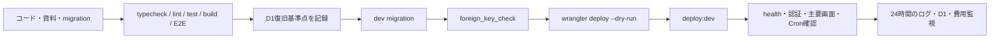

# 10. 運用・リリース設計

## 1. 対象環境

| 環境 | 用途 | Worker | D1 | 外部公開 |
|---|---|---|---|---|
| local | 開発・自動テスト | `horse-asset-manager-api` | `horse_asset_manager_local` | なし |
| dev | 結合・受入・運用確認 | `horse-asset-manager-dev` | `horse_asset_manager_dev` | Cloudflare Accessで限定 |
| prod | 一般提供 | 未構築 | 未構築 | 本番前ゲート完了後 |

dev URL、D1 IDなどの現行値は `README.md` と `apps/api/wrangler.jsonc` を参照します。Secretや認証情報を文書へ記載しません。

個人利用中はdevを実運用環境とし、Cloudflare AccessのAllowポリシーを本人のメールだけに限定します。`ALLOW_REGISTRATION` はlocalで `true`、devで `false` を既定とします。初期アカウントがまだない場合だけ一時的に `true` でデプロイして登録し、直後に `false` へ戻して再デプロイします。

## 2. 環境分離

- Worker名、D1、環境変数、Accessポリシー、Budget Alertを環境ごとに分ける。
- devへローカルのサンプルseedを投入しない。
- prod D1をdevから参照できるbindingにしない。
- prod用の秘密値はCloudflare Secretとして設定し、gitへ保存しない。
- マイグレーションはlocalで新規DBと既存DBの両方を確認してからdevへ適用する。

## 3. 通常リリースフロー



### 3.1 事前確認

```powershell
npm.cmd run typecheck
npm.cmd run lint
npm.cmd run format:check
npm.cmd test
npm.cmd run test:integration
npm.cmd run build
npm.cmd run test:e2e
```

- 変更対象とマイグレーションの有無を確認する。
- `docs/11_requirements_traceability.md` を更新する。
- 破壊的変更なら利用者影響、復旧、互換期間を明記する。
- D1 Time Travelの復旧基準時刻またはbookmarkを記録する。

### 3.2 dev適用

```powershell
npm.cmd run db:migrate:dev --workspace @horse-asset-manager/api
npm.cmd run build

Set-Location apps\api
npx.cmd wrangler deploy --dry-run --env dev --outdir .wrangler\dry-run-dev

Set-Location ..\..
npm.cmd run deploy:dev
```

### 3.3 適用後確認

```powershell
Set-Location apps\api
npx.cmd wrangler d1 migrations list horse_asset_manager_dev --remote --env dev
npx.cmd wrangler d1 execute horse_asset_manager_dev --remote --env dev --command "PRAGMA foreign_key_check;"
npx.cmd wrangler tail --env dev
```

スモークテスト:

1. `/api/health` が200で環境名`dev`を返す。
2. Accessで未許可利用者を拒否する。
3. ログイン、ダッシュボード、馬一覧、収支一覧が表示できる。
4. テスト利用者で作成・更新・アーカイブができる。
5. SPAの深いルートを直接開いて表示できる。
6. CookieがSecure/HttpOnly/SameSiteである。
7. 5xxと機密ログがない。

## 4. Cron運用

CronはUTC 0:15、日本時間9:15に日次実行します。

監視項目:

- 起動と完了
- 期限超過更新件数
- 予定生成件数
- 通知候補・新規件数
- 処理時間と例外
- ルール上限200件、アラート上限500件への到達

Cronが1回失敗しても、次回の予定補充は `generated_through_month` と一意制約により不足分を補える設計です。ただし失敗を放置せず、当日中に原因を確認します。

## 5. 観測性

### ログ

- devはWorkers Logsを有効にする。
- 即時調査は `wrangler tail --env dev` を使う。
- アプリの構造化ログは `requestId`、`durationMs`、`errorType` だけを出す。
- `x-request-id` レスポンスヘッダーを問い合わせ時の照合キーにする。
- パスワード、Cookie、Authorization、PDF本文、リクエスト本文、メール、表示名、個別金額、例外メッセージを出さない。
- 想定内の4xxをエラースタックとして大量記録しない。

### メトリクス

| 分類 | 指標 |
|---|---|
| 可用性 | リクエスト数、4xx/5xx、例外、Cron成否 |
| 性能 | Worker CPU、応答時間、D1 query duration |
| DB | rows_read、rows_written、容量、過負荷エラー |
| 業務 | 取込409、予定生成件数、通知重複抑止、照合未解決数 |
| 費用 | 月額見込、Workers/D1/Logs使用量、Budget Alert |

prod前に通知先と当番を決めます。Budget Alertは7 USDと10 USDを初期案とします。

## 6. 障害レベル

| レベル | 例 | 初動目標（案） | 方針 |
|---|---|---|---|
| SEV-1 | 他利用者漏えい、広範な金額改ざん、認証突破 | 15分 | 即時停止、Access遮断、証跡保全、責任者連絡 |
| SEV-2 | サービス全停止、主要金額誤集計、重複作成 | 30分 | 書込停止またはロールバック、影響範囲確認 |
| SEV-3 | 一部機能停止、Cron失敗、特定ブラウザ不具合 | 4時間 | 回避策、修正版、次回処理の補完 |
| SEV-4 | 軽微表示、文言、低頻度エラー | 2営業日 | 通常バックログ |

目標時間はprod運用体制を決める際に承認します。

## 7. 障害対応フロー

1. 検知時刻、環境、症状、最初のエラー、直近変更を記録する。
2. 認証・情報漏えいの可能性があればアクセスを制限し、ログを保全する。
3. 読取だけの障害か、書込・データ整合性の障害かを分ける。
4. 直近Worker変更が原因ならロールバックする。
5. D1変更が原因なら、追加書込を止めて影響行と復旧点を確認する。
6. 復旧後に固定金額データ、他利用者分離、主要画面を確認する。
7. 利用者影響、修正、再発防止、資料・テスト更新を記録する。

## 8. Workerロールバック

```powershell
Set-Location apps\api
npx.cmd wrangler rollback --env dev
```

ロールバック前に、現行・戻し先のWorker版とDBスキーマ互換性を確認します。DB migrationが後方互換でない場合、Workerだけ戻すと障害が増えるため、復旧手順をリリース単位で用意します。

## 9. D1バックアップ・復旧

### 9.1 日時付きSQLバックアップ

保存先は既定でリポジトリ直下の `.backups/d1/` です。`.backups/` はGit管理対象外です。

```powershell
# local D1
powershell -ExecutionPolicy Bypass -File scripts\backup-d1.ps1 -Local

# remote dev D1（既定）
powershell -ExecutionPolicy Bypass -File scripts\backup-d1.ps1
```

ファイル名は `horse_asset_manager_<環境>-YYYYMMDD-HHmmss.sql` 形式です。初回運用時、各DB変更前、重要な一括操作前に取得し、終了コード0と非空ファイルを確認します。バックアップには個人情報・金額が含まれるため、共有フォルダーへ置かず、OSアカウントとディスク暗号化で保護します。

### 9.2 新しいローカルD1への復元確認

```powershell
powershell -ExecutionPolicy Bypass -File scripts\restore-d1-local.ps1 `
  -BackupFile .backups\d1\<バックアップファイル>.sql
```

このスクリプトは既存local D1を上書きせず、`.wrangler/restore-validation/<日時>/` に新規D1を作成します。先に全migrationを適用し、export内のINSERTを外部キー順へ並べて投入し、最後に `PRAGMA foreign_key_check;` を実行します。2026-08-12にlocalバックアップを1回復元し、外部キー違反0件を確認済みです。

### 9.3 dev Time Travel訓練

D1 production storageではTime Travelを利用できます。remote devの復元は共有状態を変更するため、利用を止め、直前SQLバックアップを確保してから明示的に実施します。

1. `wrangler d1 info` でTime Travel対応versionを確認する。
2. 復旧試験用データを作り、時刻またはbookmarkを記録する。
3. 試験データを変更する。
4. Time Travelのinfoで対象bookmarkを確認する。
5. devの利用を止めてrestoreする。
6. migration一覧、foreign key、固定データ、アプリ画面を確認する。
7. 所要時間と手順差分を記録する。

今回の実装作業ではlocal SQLバックアップ・新規D1復元まで実施済みです。remote devのTime Travelは外部DBを巻き戻すため自動実行せず、最初の実データ投入前または次回DB変更前の手動チェックとして残します。

### 復旧目標の初期案

| 指標 | 案 | 備考 |
|---|---|---|
| RPO | 1時間以内 | Time Travelは分単位だが、検知・判断時間を含めて承認する |
| RTO | 4時間以内 | 小規模MVPの手動復旧を想定 |

本番SLAではなく、限定公開前に運用者が承認する目標です。

## 10. マイグレーション方針

- 原則として追加→移行→参照切替→後日削除の後方互換手順を使う。
- 既存カラムの即時rename/dropを避ける。
- 大量UPDATE/DELETEは小さい単位へ分ける。
- 適用前後の行数、NULL、一意性、外部キーを確認する。
- migrationファイルを適用後に書き換えない。
- 失敗時は同じファイルを場当たり的に再実行せず、状態を確認して修正migrationを作る。

## 11. データ削除運用

- 馬の完全削除は利用者操作で即時実行され、アプリ内復元機能はない。
- 運用者が利用者の代わりにSQLで馬を削除しない。
- 誤削除相談時は復旧保証をせず、Time Travelによる全DB復旧が他利用者へ与える影響を評価する。
- 退会・全データ削除、監査・通知保持、バックアップ中の削除反映はprod前に決める。
- 削除要求・インシデント対応で個人データを別ファイルへ不用意に複製しない。

## 12. 定期保守

| 頻度 | 作業 |
|---|---|
| 日次 | Cron、5xx、SEVアラート、費用急増の確認 |
| 週次 | D1 read/write、CPU、ログ、未解決照合・重複エラー傾向 |
| 月次 | 依存更新、容量、Budget Alert、Access許可者、復旧bookmark手順 |
| 四半期 | Cloudflare価格・上限、脅威モデル、保持方針、復旧訓練 |
| リリースごと | 品質ゲート、migration、スモーク、24時間監視 |

## 13. prod構築前チェック

- [ ] prod専用Worker・D1・Secret・ドメインを作成
- [ ] 認証本番化とレート制限を完了
- [ ] Accessまたは公開境界を承認
- [ ] Budget Alert、CPU上限、ログ保持を設定
- [ ] Time Travel復旧訓練を完了
- [ ] 監視通知先とSEV責任者を決定
- [ ] 利用規約、プライバシー、保持・退会削除方針を用意
- [ ] Chrome/Edge受入とアクセシビリティ監査を完了
- [ ] P0/P1不具合0件
- [ ] devとprodがD1・Secretを共有していないことを確認
